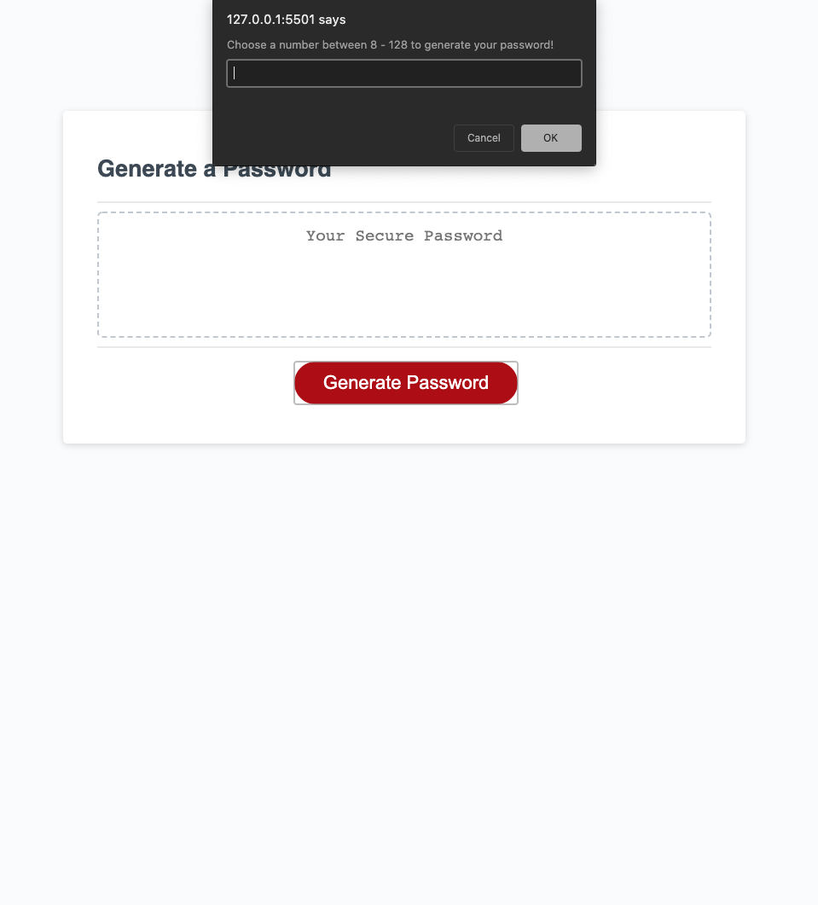
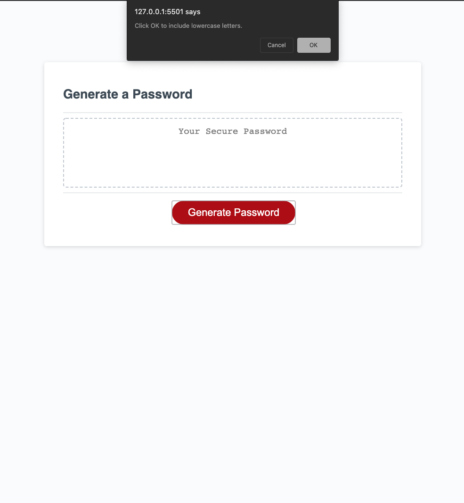
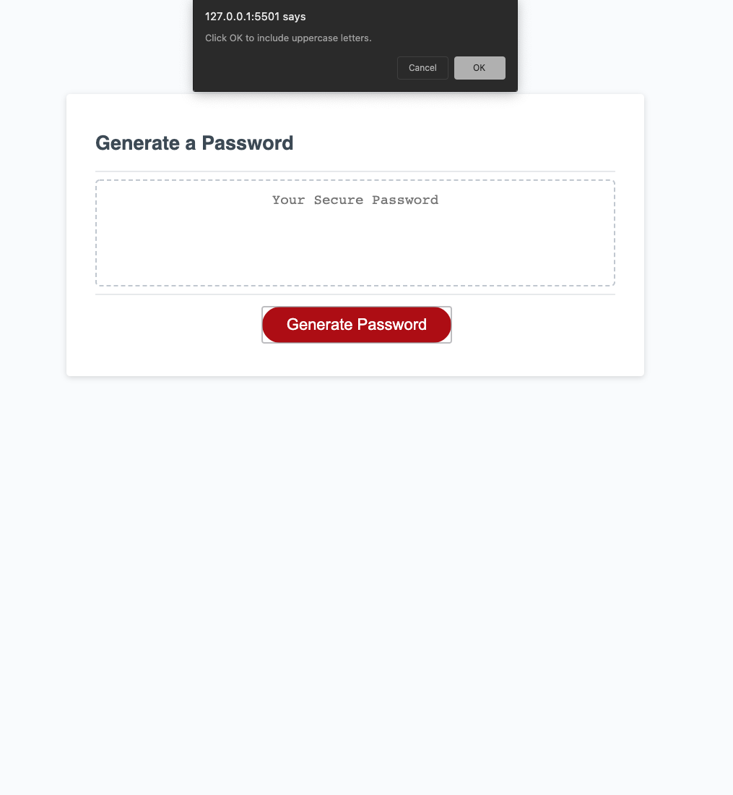
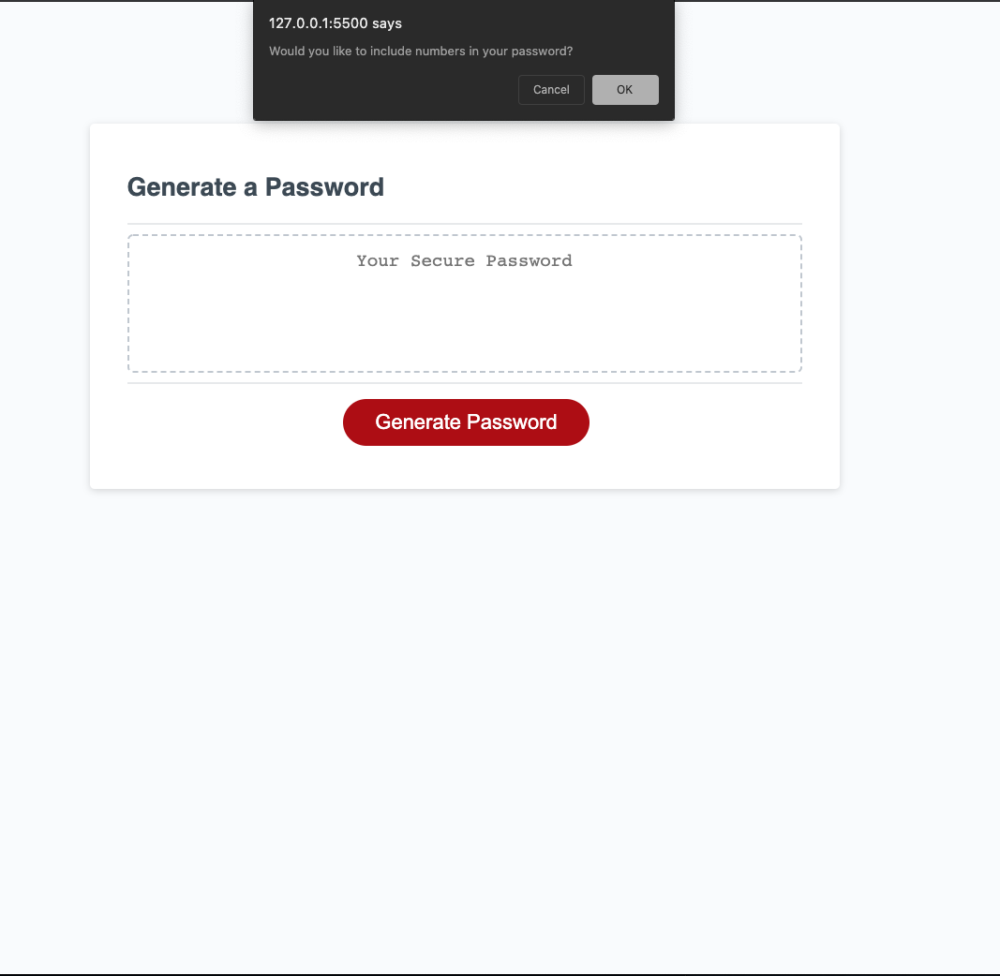
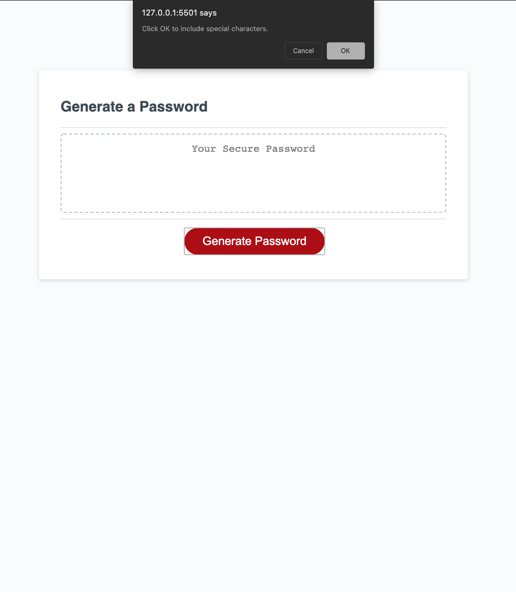
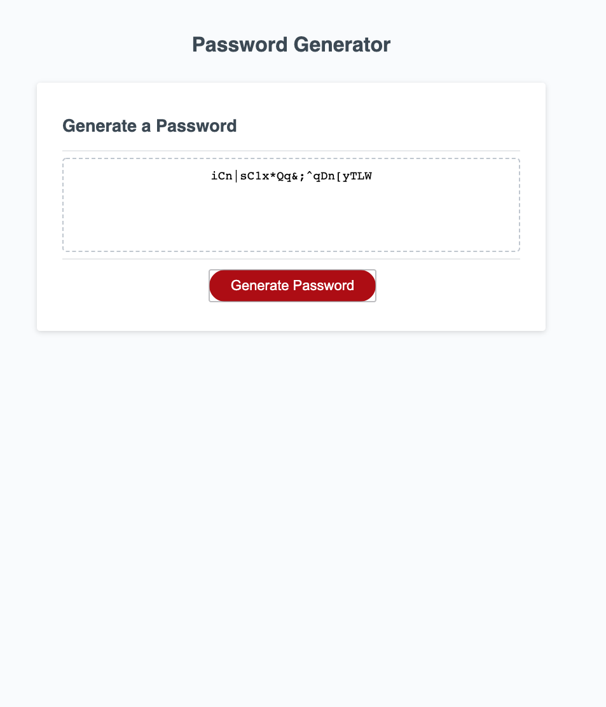

# Project Objective

The main objective of this project was to create a password application that provided the user with a clean, easy interface used to generate a randomized password based off of the criteria they decide. 

# Variable Declaration & Arrays

Using arrays and Scoped Variables I am able to create internal list that are acceptable characters for the user. These arrays trigger bolean values and are stored in an empty array. This "passwordPool" array contains all of the conditions that were selected by the user to include in their final generated password. 

The passwordPool array is then looped for a final result. 

# Functions

The main function that runs is the "passwordGen" function. This function runs all of the scope variables, confirms, conditions and loops needed to create a final result to the user. 

# Error Conditioning

Throughout the JS I have placed a few conditions to run for errors. One of those conditions is if the user doesn't choose anything to be included in their password, if this is the case the alert "Please enter a password criteria" will pop up! Another conidition is one to ensure that there will be at least one character from the selected criteria included. Without this we run the chance of including many of the same items in a single array. 

# Screenshots-

