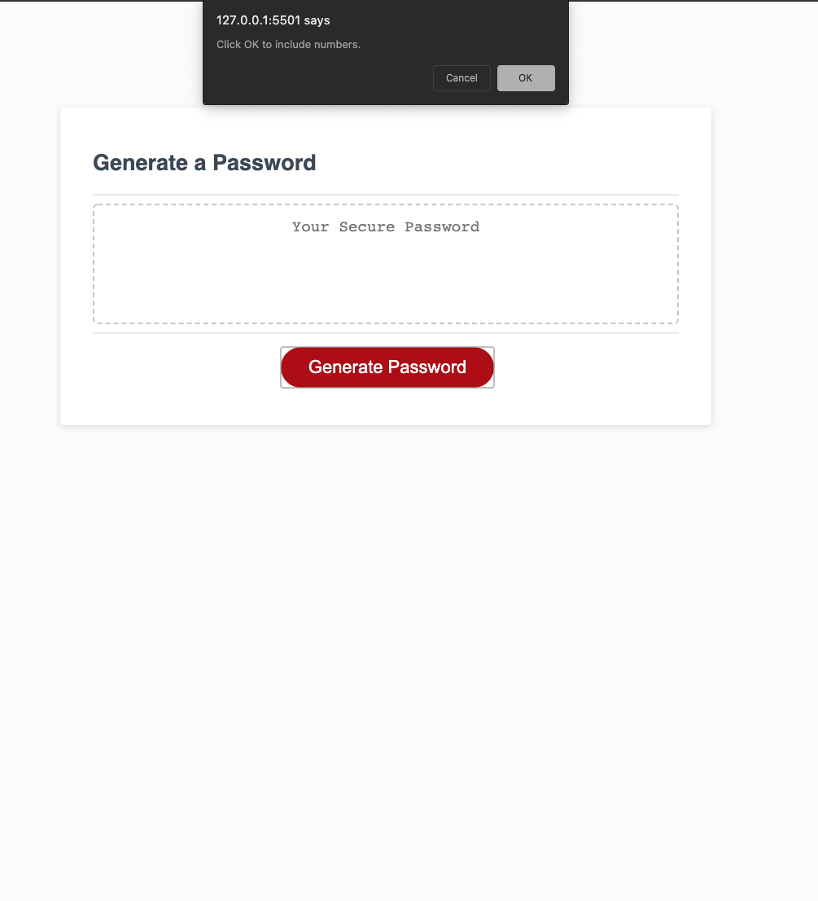

# Project Objective

The main objective of this project was to create a password application that provided the user with a clean, easy interface used to generate a randomized password based off of the criteria they decide. 

# Variable Declaration & Arrays

Using arrays and Scoped Variables I am able to create internal list that are acceptable characters for the user. These arrays trigger bolean values and are stored in an empty array. This "passwordPool" array contains all of the conditions that were selected by the user to include in their final generated password. 

The passwordPool array is then looped for a final result. 

# Functions

The main function that runs is the "passwordGen" function. This function runs all of the scope variables, confirms, conditions and loops needed to create a final result to the user. 

# Screenshots

